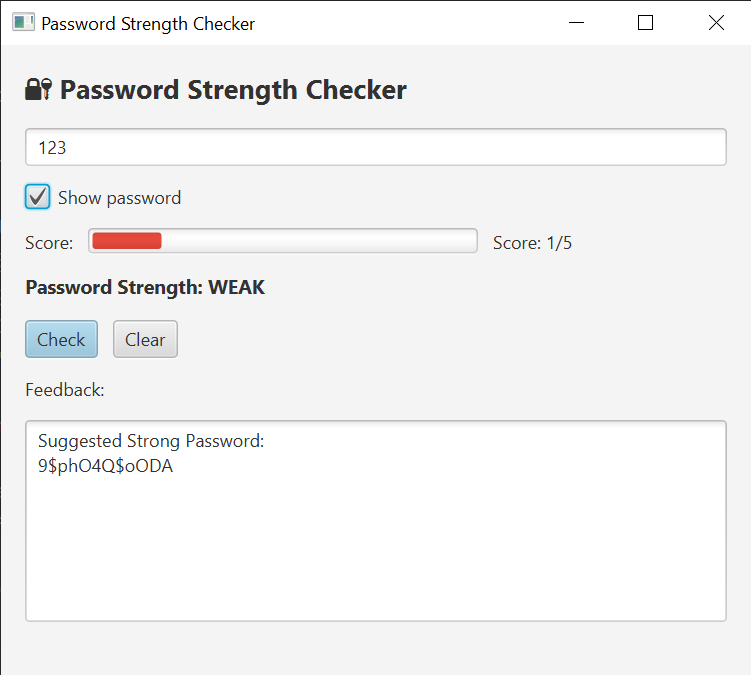
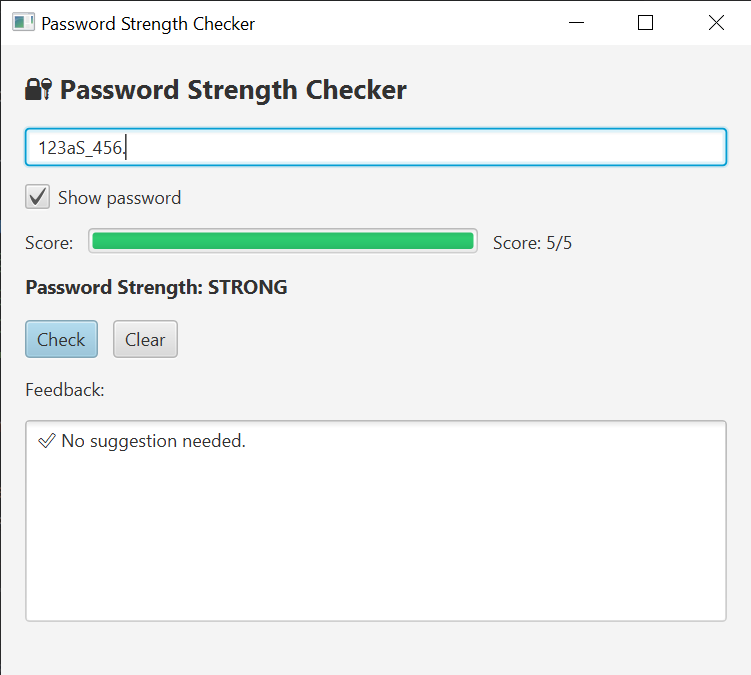
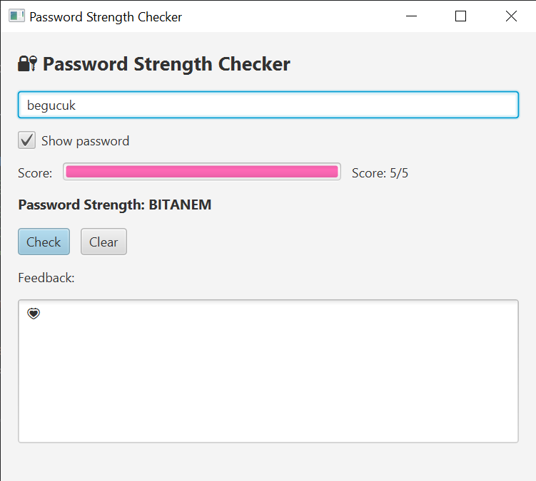

# 🔐 Password Strength Checker — JavaFX


A **JavaFX GUI version** of my learning-focused **Password Strength Checker** project.  
This application evaluates password strength in real time and provides visual feedback using colors, progress bars, and suggestions.

The core password evaluation logic is **shared with the original Java console version**, ensuring consistency across different interfaces.

## 🔗 Original Console Version

This JavaFX project is based on and shares logic with the original Java console version:

👉 **Original Java Console Project:**  
https://github.com/atakankeskin99/password-strength-checker

---

## 🎯 Features

- Real-time password strength evaluation
- Visual strength indicator (ProgressBar with color feedback)
- Verdict levels: **WEAK / MEDIUM / STRONG**
- Strong password suggestion for weak passwords
- Easter egg support for special passwords 💗
- Show / hide password toggle
- Clean separation between **UI** and **core logic**

---

## 🖼️ Screenshots

<p align="center">
  <br/>
  <em>Password strength evaluation — Weak case</em>
</p>

<br/>

<p align="center">
  <br/>
  <em>Password strength evaluation — Medium case</em>
</p>

<br/>

<p align="center">
  <br/>
  <em>Password strength evaluation — Strong case</em>
</p>

<br/>

<p align="center">
  <br/>
  <em>Special message displayed for predefined passwords</em>
</p>


---

## 🧠 Case Study

### Problem
While building a console-based password strength checker, I wanted to:
- Improve user experience
- Provide instant visual feedback
- Reuse the same password evaluation logic without duplication

### Solution
I implemented a **JavaFX GUI layer** on top of the existing logic by:
- Extracting password evaluation rules into a reusable **core module**
- Letting the JavaFX UI act only as a presentation layer
- Preserving all original rules and easter eggs from the console version

This approach allows the same logic to be reused for:
- Console applications
- JavaFX GUI
- Potential future web or mobile interfaces

### Outcome
- Cleaner architecture
- Better user experience
- Easier testing and maintenance
- Stronger portfolio project showcasing separation of concerns

---

## 🧩 Project Structure

```text
src/main/java/com/atakan
├── PasswordCheckerApp.java        # JavaFX UI (presentation layer)
├── PasswordStrengthCore.java      # Core password evaluation logic
├── PasswordGenerator.java         # Strong password generator
└── StrengthResult.java            # Result data model
```


## 🚀 How to Run

This project uses JavaFX with Maven.
```text
mvn javafx:run
```


⚠️ Running via IntelliJ's default “Run” button may cause JavaFX runtime errors.
Always run using Maven (javafx:run).

---

## 📌 Notes

- This is a **learning-focused project**, not a production security tool
- Password rules are intentionally simple for educational clarity
- The goal is to practice Java, JavaFX, and clean architecture principles
- UI and core logic are intentionally separated for reusability

---

## ✨ Learning Highlights

- JavaFX UI development
- CSS-based visual feedback in JavaFX
- Separation of UI and business logic
- Reusable core design
- Maven-based JavaFX project setup

